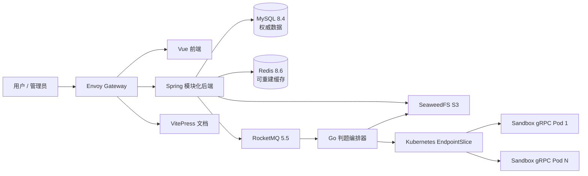
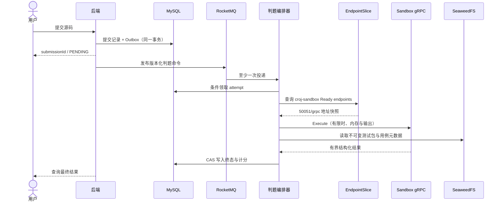

# 平台架构

CodeRushOJ 保留 Vue 3、Spring Boot、Go、RocketMQ 与 gRPC 的已有技术积累，同时将无法跑通的发现与执行边界调整为 Kubernetes 原生模型。

::: warning 当前与目标边界
后端“提交 + Outbox”事务和 judging-server 的 EndpointSlice 发现已经实现；sandbox 的 gRPC Execute 与健康服务也已存在。但 judging-server 当前仍保留模拟 Accepted 路径，真实 gRPC 用例执行、CAS 终态写回和失败幂等重试尚未端到端跑通。下面两张图描述目标态，不表示当前已经完成生产判题。
:::

## 目标态组件流

## 仓库边界

| 仓库 | 所有权 |
| --- | --- |
| `croj-frontend` | 用户、竞赛、论坛、题解和管理界面 |
| `croj-backend` | 业务规则、MySQL 事务、RBAC、Outbox 与 API |
| `croj-judging-server` | 消息消费、EndpointSlice 发现、目标态幂等领取与结果归并 |
| `croj-sandbox` | 编译、受限执行、用例结果与判题协议 |
| `croj-platform` | 部署、集成测试、运维文档和协调发版 |

## 目标态提交与判题时序

## Kubernetes Service/Endpoint 发现

判题服务发现不再依赖 ZooKeeper。Chart 可渲染 `croj-sandbox` gRPC Deployment，Service 固定暴露名为 `grpc` 的 `50051/TCP` 端口。判题编排器已经能读取 Service 拥有的 EndpointSlice，只选择 Ready 且未终止的地址，并以并发安全的轮询策略负载均衡；真实 Execute 调用仍待接线。Pod UID 通过 Downward API 注入执行器，避免同一节点上的 cgroup 名冲突。

本地 Kind profile 把 sandbox 放在 `coderushoj.io/judge-worker=true` 节点，并显式开启 `hostPID`、privileged、host cgroup 挂载和 `nsenter`；这是高权限开发配置。production reference 默认禁用，因为当前非 root/Kata 组合没有经过验证的可写 cgroup 委派，执行器的 child seccomp 与 fail-closed 边界也尚未完成。两种 profile 不能混用。

## 数据职责

- MySQL 是用户、题目、提交、竞赛、社区内容和审计记录的唯一权威来源。
- Redis 只保存限流、短期验证、热点榜单与可重建会话状态。
- RocketMQ 只承载标识符和版本元数据，不传递隐藏测试数据。
- SeaweedFS 保存不可变测试包、头像和社区附件；应用只依赖 S3 协议，便于替换为云对象存储。

## 信任边界

后端和判题编排器属于可信控制面；参赛源码与 sandbox Pod 属于不可信计算面。生产目标是隔离 RuntimeClass、不可降级的 child 身份/seccomp、明确委派的 cgroup、资源配额、专用节点和强制执行的默认无网络策略。当前开发 profile 的高权限和 Kind 默认 kindnet 都不构成生产安全基线；NetworkPolicy 强制执行由 Issue #4 跟踪。测试数据凭据只应提供给可信控制面，不直接挂载到参赛程序。
