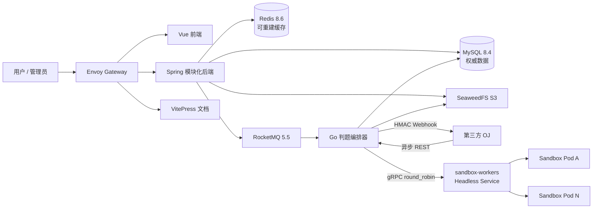
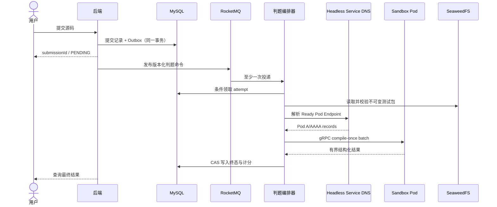

# 平台架构

CodeRushOJ 保留 Vue 3、Spring Boot、Go、RocketMQ 与 gRPC 的已有技术积累，同时将无法跑通的发现与执行边界调整为 Kubernetes 原生模型。

## 仓库边界

| 仓库 | 所有权 |
| --- | --- |
| `croj-frontend` | 用户、竞赛、论坛、题解和管理界面 |
| `croj-backend` | 业务规则、MySQL 事务、RBAC、Outbox 与 API |
| `croj-judging-server` | 异步 REST/RocketMQ 接入、持久化领取、统一执行、结果与 Webhook |
| `croj-sandbox` | 编译、受限执行、用例结果与判题协议 |
| `croj-platform` | 部署、集成测试、运维文档和协调发版 |

## 提交与判题时序

## Kubernetes Service/Endpoint 发现

判题服务不再依赖 ZooKeeper，也默认不读取 Kubernetes API。`sandbox-workers` 是 `clusterIP: None` 的 headless Service，Kubernetes 根据 Ready Pod 维护 EndpointSlice 和 DNS A/AAAA 记录；判题服务使用 `dns:///sandbox-workers.<namespace>.svc.cluster.local:50051` 建立 gRPC `round_robin` channel，在每次 RPC 时选择健康 Pod。沙箱 Deployment 通过 `coderushoj.io/sandbox=true` 固定到专用节点，探针、滚动更新、PDB 和并发上限共同控制容量。直接读取 EndpointSlice 只保留为显式启用的兼容路径。

## 外部异步 REST 边界

第三方 OJ 先上传不可变测试包，再以 Idempotency-Key 提交作业；`202 Accepted` 只表示任务已持久化。客户端轮询作业资源或配置回调。终态与 Webhook outbox 在同一 MySQL 事务提交，投递使用稳定 event ID、HMAC v1、租约 fencing 和有界重试。外部 HTTP 不直接暴露 gRPC 沙箱，源码与隐藏数据也不会进入 URL、日志或消息队列。

外部路由默认关闭；Kind profile 为本机调试显式开启。生产环境使用独立 HTTPS hostname，回调出口应经审计 egress gateway；应用层仍必须执行 DNS 重绑定、私网地址和重定向校验。

## 数据职责

- MySQL 是用户、题目、提交、竞赛、社区内容和审计记录的唯一权威来源。
- Redis 只保存限流、短期验证、热点榜单与可重建会话状态。
- RocketMQ 只承载标识符和版本元数据，不传递隐藏测试数据。
- SeaweedFS 保存不可变测试包和外部判题私有对象；应用只依赖 S3 协议，便于替换为云对象存储。现有头像接口暂由单副本后端的 RWO PVC 承载，迁移到统一 S3 适配器前不声明多副本高可用。

## 信任边界

后端和判题编排器属于可信控制面；参赛源码与沙箱 Pod 内的编译/执行进程属于不可信计算面。当前沙箱需要在专用节点上使用 host PID、cgroup 挂载和受控特权容器，因此不能与普通业务工作负载混部。参赛进程必须继续受到 cgroup、seccomp、命名空间、资源/输出/时间上限和默认拒绝网络策略约束；对象存储凭据只由可信判题进程使用，不传给参赛程序。
