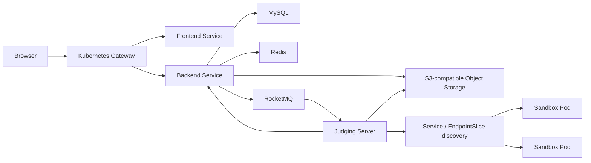

# CodeRushOJ 真实产品闭环设计

日期：2026-07-19  
状态：已批准，进入实现

## 1. 目标与完成定义

本阶段不以“页面可访问”为完成标准，而以管理员和普通用户都能通过真实数据完成核心工作流为标准。主路径不得依赖浏览器内 mock、静态题目夹具或绕过鉴权的预览账号。

必须跑通的纵向闭环：

1. 管理员创建题目草稿并编辑题面、限制、标签和可见性。
2. 管理员上传带 manifest 的测试用例 ZIP；后端流式校验大小、路径、摘要和用例配对后写入对象存储。
3. 管理员原子发布题目版本；已发布版本及其测试包不可变。
4. 用户读取真实题目详情、提交代码并看到排队、运行及最终结果。
5. Judging Server 消费版本化消息，按固定题目版本读取测试包，通过 Kubernetes Service/EndpointSlice 发现健康沙箱，回调幂等写入结果。
6. 用户能围绕题目或比赛发表讨论，能围绕题目发布题解；管理员可发布系统公告和比赛公告。
7. 管理能力从个人头像菜单进入独立管理工作台，普通导航不暴露后台入口。
8. Docker Compose 可用于开发闭环，Kind/Helm 可用于生产形态验证；CI 在合并前验证数据库迁移、服务契约、镜像、安全和真实 E2E。

## 2. 产品与界面方向

界面采用克制的暖色中性设计：暖白背景、炭黑正文、低饱和橙色强调、细分隔线和少量阴影。减少大面积渐变、悬浮玻璃卡片、营销式文案和无意义图标。信息层级主要依靠字号、留白和对齐建立。

核心信息架构：

- 顶部：题库、比赛、讨论、公告；右侧搜索、通知和用户菜单。
- 用户菜单：个人主页、提交记录、收藏、设置；管理员额外显示“管理工作台”。
- 题目页：左侧题面/讨论/题解标签，右侧编辑器、语言、运行与提交结果；窄屏改为上下布局。
- 管理工作台：题目、测试包、比赛、公告、用户与系统状态。
- 页面只展示真实 API 状态；网络、空数据、权限和服务不可用必须有可执行的错误反馈。

## 3. 领域模型与接口边界

### 3.1 题目与测试包

- `Problem` 保存稳定身份与当前发布版本引用。
- `ProblemVersion` 保存不可变题面、限制和配置快照，生命周期为 `DRAFT -> PUBLISHED -> RETIRED`。
- `TestBundle` 保存对象键、SHA-256、字节数、用例数、manifest 版本和状态，并只关联一个题目版本。
- 发布事务必须验证题面完整、测试包已验证且当前草稿未被并发更新。
- ZIP 解压必须拒绝绝对路径、`..`、符号链接、重复路径、解压炸弹和未声明文件；上传/展开大小、文件数和单文件大小均配置上限。

建议接口：

- `POST /api/v1/admin/problems`
- `PUT /api/v1/admin/problems/{problemId}/draft`
- `POST /api/v1/admin/problems/{problemId}/test-bundles`（multipart）
- `POST /api/v1/admin/problems/{problemId}/publish`
- `GET /api/v1/problems/{problemNo}`

### 3.2 可扩展题目导入

导入不是绕过题目工作台的第二套写入逻辑。所有外部格式先由解析器转换成统一的 `ProblemImportDraft`，经过预检和管理员确认后，再创建 CodeRushOJ 草稿版本、测试包并走相同的发布门禁。

首批格式：

1. `FPS_XML`：准确兼容 FreeProblemSet FPS 1.1/1.2。覆盖题面、时/内存限制、多组样例、隐藏测试、内嵌图片、来源、标准解、代码模板、SPJ/TPJ/Interactor 和远程题目标识。
2. `CODERUSH_PACKAGE`：CodeRushOJ 原生 ZIP，使用版本化 JSON manifest，适合完整无损导入导出。
3. `ICPC_PACKAGE`：兼容 `problem.yaml`、statement、sample/secret data 的 ICPC/DOMjudge/Kattis 风格题包。
4. `POLYGON_PACKAGE`：兼容 Polygon 导出包的 `problem.xml`、statements、solutions 和 tests。

解析器使用 SPI/注册表隔离格式差异，并输出统一的能力与警告列表。无法无损映射的字段不得静默丢失；预检结果必须标明错误、警告、题目数、用例数、资源大小、检测格式和摘要。批量导入采用作业模型，单题失败不能留下已发布的半成品。

安全约束：

- XML 解析禁用 DTD、外部实体、XInclude 和网络访问，限制节点深度、文本长度和题目数，防止 XXE 与实体扩展攻击。
- ZIP 继续执行路径、链接、文件数、压缩比、展开大小和单文件大小限制。
- HTML/Markdown 在服务端净化；图片只允许白名单 MIME 并重新生成安全对象键。
- SPJ、Interactor、标准解和模板只作为受控资源存储，导入阶段绝不执行。
- 保存来源格式、来源 URL、导入器版本、原始包 SHA-256 和授权/署名元数据，支持审计与幂等重试。

FreeProblemSet 兼容基线固定到上游提交 `7782b3815fd40f5bba95b5d7b90e3fbefafae656`。其 README 将 FPS 定义为 LGPL-3.0 的开放交换格式，并列出 HUSTOJ、Hydro、OpenJudger 和 QDUOJ 的兼容性；实现必须保留格式署名与许可证说明。

### 3.3 提交与判题

- 提交记录固定 `problemVersionId` 和 `testBundleId`，后续发布不得改变历史判题语义。
- 数据库事务通过 outbox 记录待发送事件；发布器向 MQ 发送版本化消息并带幂等键。
- Judging Server 校验消息 schema、版本和测试包摘要；沙箱端点只取 Ready 且未超载的 EndpointSlice 地址。
- 回调以提交 ID + 判题 attempt 幂等，旧 attempt 不得覆盖新 attempt。
- 前端先以短轮询实现结果更新，保留升级 SSE 的接口边界。

### 3.4 讨论、题解与公告

- 讨论主题显式使用 `resourceType` + `resourceId` 关联 `PROBLEM`、`CONTEST` 或 `GENERAL`。
- 题目详情的讨论标签仅查询当前题目的主题；比赛讨论同理。
- 题解必须关联题目，可选择固定题目版本；发布、草稿和审核状态独立。
- 系统公告与比赛公告共用公告领域，通过 scope 区分 `GLOBAL` 和 `CONTEST`；支持草稿、定时发布、置顶和过期。

## 4. 运行架构

开发环境使用 Compose 提供 MySQL、Redis、RocketMQ 和 S3 兼容存储；Kind 负责验证与生产相同的 Gateway、Service、EndpointSlice、Secret、探针和安全上下文。生产不依赖 Compose。

## 5. GitHub Pages 与文档

GitHub Pages 发布平台仓库的 VitePress 文档和静态产品导览，不伪装成可运行的 OJ。真实前端/API 地址由文档配置指向 Kubernetes Gateway。

Pages 包含：快速开始、Compose 开发、Kind 部署、生产 Helm、架构、API/事件契约、题目测试包格式、运维、备份恢复、安全和版本日志。

## 6. CI 与发布门禁

每个仓库执行自身单元/集成测试、lint、构建和镜像扫描。平台仓库额外执行：

- 全仓库固定提交的契约测试。
- MySQL 从空库和上一版本升级的迁移测试。
- Compose API smoke。
- 三节点 Kind 部署与真实 E2E：管理员创建题目、上传测试包、发布、用户提交、判题回调、结果可见、题目讨论和系统公告可见。
- SBOM、Trivy、Secret 扫描、非 root/只读根文件系统验证。
- 文档构建与链接检查、GitHub Pages 预览及部署。

只有 P0/P1 缺陷归零、依赖 PR 全绿、真实 E2E 通过后才按依赖顺序合并到各仓库实际默认分支 `main`。每个发版必须更新 `VERSION`、`CHANGELOG.md`、里程碑和 GitHub Release。

## 7. 非目标

- 当前阶段不实现付费、商城或商业结算。
- GitHub Pages 不承载动态 OJ 后端。
- 不以 mock 数据、内存数据库或手工修改数据库作为验收路径。
- 不在本阶段导入大规模第三方题库；先完成可审计的手工题目/测试包闭环，再接入 FreeProblemSet 导入器。
